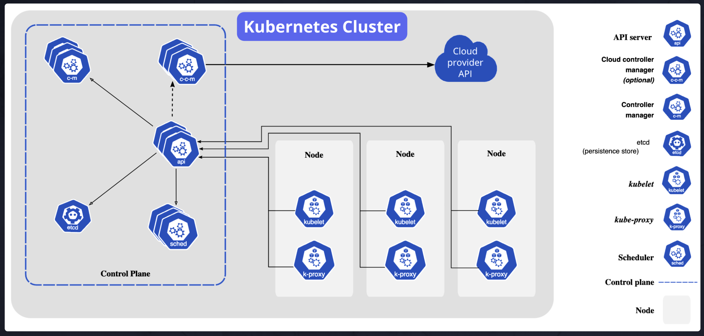

Here's how you can structure the content about **Node Types in Kubernetes** into a Markdown file, with a clear explanation and an optional placeholder for a node diagram:

````markdown
# Node Types in Kubernetes

In a production Kubernetes cluster, there are two main types of nodes that serve different purposes:

1. **Control Plane**
2. **Worker Nodes**



### 1. Control Plane

The **Control Plane** is responsible for managing the entire Kubernetes cluster. It contains the components that make global decisions about the cluster, such as scheduling and scaling workloads, monitoring the cluster’s health, and handling API requests. These components include:

- **API Server**: The main entry point for interacting with the Kubernetes cluster. It processes RESTful requests and communicates with other control plane components.
- **Scheduler**: Decides which nodes should run the different pods based on resource availability, constraints, and policies.
- **Controller Manager**: Manages controllers that ensure the cluster is operating as desired, such as the Replication Controller (which ensures the correct number of replicas for pods).

#### Control Plane Nodes (Deprecated Term: Master Nodes)

The control plane was previously referred to as **master nodes** in Kubernetes, but the term "master" has been deprecated to avoid confusion and better reflect the distributed nature of Kubernetes management. The control plane is usually fully managed in **cloud-managed Kubernetes services** like GKE, EKS, and AKS, so you generally don’t need to worry about the specifics of managing these nodes in those environments.

### 2. Worker Nodes

**Worker Nodes** are where your application workloads (i.e., containers) actually run. These nodes are responsible for hosting the **pods** (the smallest deployable units in Kubernetes). Each worker node runs several key components:

- **Kubelet**: Ensures that the containers running on the node are healthy and running as expected. It communicates with the control plane to report the status of the node.
- **Kube Proxy**: Handles network communication between pods on different nodes. It ensures that network traffic reaches the correct pod, even when multiple pods are running on different nodes.
- **Container Runtime**: The software responsible for running the containers (such as Docker, containerd, or CRI-O).

#### Worker Nodes in GKE

In a cloud-managed Kubernetes environment like **Google Kubernetes Engine (GKE)**, the control plane is fully managed by the cloud provider, and you typically only need to interact with the **worker nodes**. When running the command:

```bash
kubectl get nodes
```
````

You may get output similar to:

```bash
NAME                                       STATUS   ROLES    AGE     VERSION
gk3-kube-prod-nap-1cmjprlt-92e1dc91-jmi8   Ready    <none>   5d21h   v1.25.12-gke.500
gk3-kube-prod-nap-1cmjprlt-dfe4d6de-cq0k   Ready    <none>   5d21h   v1.25.12-gke.500
```

In this output, both nodes are **worker nodes**, running the containers that are part of your application. **The control plane is managed by GKE**, so you don’t have to worry about it, and your focus will be on ensuring your **worker nodes** are healthy and scaling appropriately based on demand.

### Node Diagram

Here’s a simple diagram showing the relationship between **control plane** and **worker nodes** in a Kubernetes cluster:

```plaintext
          +----------------------------------+
          |       Control Plane             |
          |   (API Server, Scheduler,       |
          |    Controller Manager)          |
          +----------------------------------+
                     |
    +----------------+------------------+
    |                                   |
+-----------+                     +-----------+
| Worker    |                     | Worker    |
| Node 1    |                     | Node 2    |
| (Pod 1)   |                     | (Pod 2)   |
+-----------+                     +-----------+
```

### Key Takeaways:

- **Control Plane** manages the Kubernetes cluster, but it is often fully managed by cloud providers in services like GKE, EKS, and AKS.
- **Worker Nodes** are where your containers (pods) run, and you usually interact with them directly when scaling and managing workloads.
- **Cloud Managed Services** like GKE abstract away the complexity of the control plane, allowing you to focus on managing and scaling your worker nodes.

In a **production environment**, you'll mostly focus on **worker nodes** for scaling your application, while the **control plane** typically remains static and fully managed.

```

### Key Points:
- The **Control Plane** handles the management and orchestration of the Kubernetes cluster.
- The **Worker Nodes** are responsible for actually running the workloads (pods).
- **Cloud-managed services** (like GKE) take care of the control plane, simplifying cluster management for you.
```
