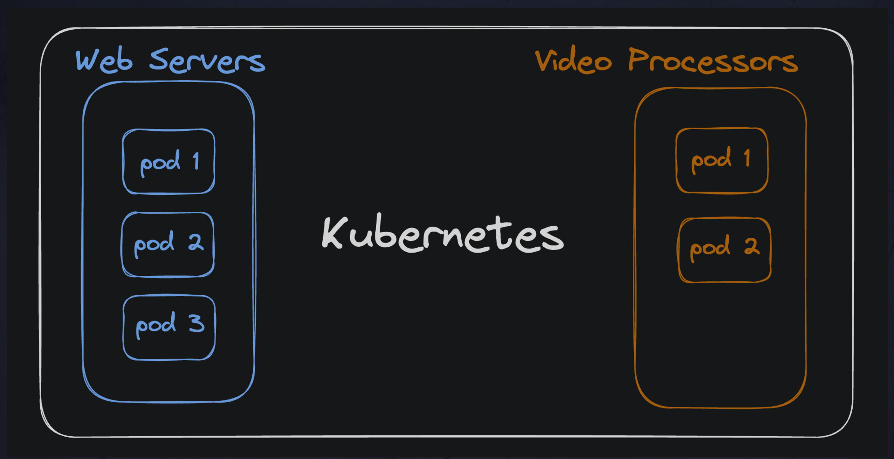

# Understanding Pods in Kubernetes

> "Pods are the smallest deployable units of computing that you can create and manage in Kubernetes."
>
> — The Kubernetes Team

## What is a Pod?

A **Pod** is the smallest and simplest unit in the Kubernetes object model that you create or deploy. It represents one (or sometimes more) running container(s) in a Kubernetes cluster.

In a simple web application, you might start with a **single pod** for the web server. As traffic grows, you could deploy that same application across **multiple pods** to handle the increased load.

For example:

- **One Pod**: A single web server container running.
- **Multiple Pods**: If traffic increases, you can run several pods with the same codebase to handle the load.

In more complex systems, you might have:

- **Multiple Pods for Web Servers**: Handling HTTP requests.
- **Multiple Pods for Video Processing**: Performing backend tasks.

Each **Pod** typically contains one or more containers that share the same resources, network, and storage.

### Pods as Containers with Extra Kubernetes Magic

A pod is essentially a **wrapper around a container**. You can think of it as a Docker container with a bit of extra **Kubernetes functionality**.

- The **container** is the actual application running inside the pod.
- The **pod** manages the container and ensures it has the resources it needs to run properly in the cluster.

### Pod Illustration

Imagine you have a simple web application running inside a Docker container. When you deploy it to Kubernetes, you wrap the container inside a pod. The pod is what Kubernetes manages, ensuring the container is running and that it can scale, interact with other services, or be rescheduled if something goes wrong.



## Assignment: Deploy a Second Pod

Let's now deploy a second pod!

### Steps:

1. **Check the existing pods**:
   Run the following command to see a list of all your running pods:

   ```bash
   kubectl get pods
   ```

   You should see the `synergychat-web` pod running.

2. **Edit the Deployment**:
   We will now edit the deployment to scale the pod to two replicas.

   Run the following command:

   ```bash
   kubectl edit deployment synergychat-web
   ```

   This will open the deployment configuration in your default text editor. Under the `spec` section, you should see the following:

   ```yaml
   spec:
     ...
     replicas: 1
     ...
   ```

3. **Update the Replicas**:
   Change the value of `replicas` from `1` to `2` so the deployment will scale to two pods:

   ```yaml
   spec:
     ...
     replicas: 2
     ...
   ```

4. **Save and Exit**:
   Save the changes and close the editor. Kubernetes will automatically apply these changes and scale the deployment.

5. **Verify the Pods**:
   Now, run the following command again to confirm that the deployment has scaled:

   ```bash
   kubectl get pods
   ```

   You should now see **two pods** for `synergychat-web` running in your cluster.

---

This exercise demonstrates how to scale a deployment by adjusting the `replicas` field in the deployment configuration, thereby adding more pods to handle increasing demand.

```

### Key Takeaways:
- **Pods** are the basic unit of deployment in Kubernetes, typically wrapping containers.
- Pods can be scaled to handle more traffic by adjusting the number of replicas in the deployment.
- In this assignment, you scaled the `synergychat-web` deployment from 1 pod to 2 by modifying the `replicas` field.
```
