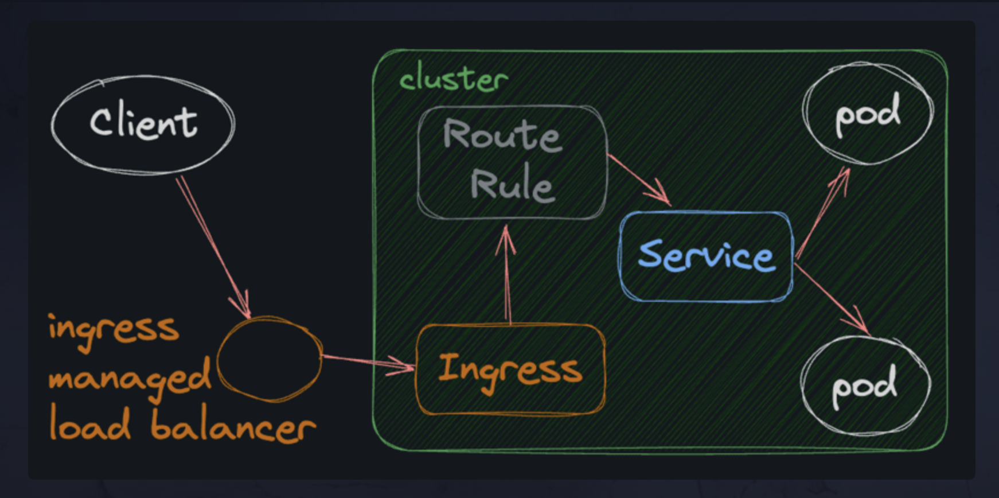

# Ingress

An **Ingress** resource exposes services to the outside world and is commonly used in production environments. From the official docs:

> An Ingress may be configured to give Services externally-reachable URLs, load balance traffic, terminate SSL / TLS, and offer name-based virtual hosting. An Ingress controller is responsible for fulfilling the Ingress, usually with a load balancer, though it may also configure your edge router or additional frontends to help handle the traffic.

An **Ingress** does not expose arbitrary ports or protocols. Exposing services other than HTTP and HTTPS to the internet typically uses a service of type `Service.Type=NodePort` or `Service.Type=LoadBalancer`.



## Assignment

To work with an **Ingress**, first, we need to enable it in **minikube**:

```bash
minikube addons enable ingress
```

````

Next, create a new file. We'll call it `app-ingress.yaml` because it will be an Ingress for the entire SynergyChat application, not just a specific service.

### Step 1: Add Metadata

We begin by adding metadata to the Ingress YAML file. This will include annotations and the name of the Ingress:

```yaml
apiVersion: networking.k8s.io/v1
kind: Ingress
metadata:
  name: app-ingress
  annotations:
    nginx.ingress.kubernetes.io/rewrite-target: /
```

- The `annotations` section is where we can add extra configuration for our Ingress. In this case, we're telling it to rewrite the target URL to `/` so that it will work with our web app.

### Step 2: Add Rules

Next, we need to add a `spec/rules` section. This is where we define the routing rules for our Ingress. We only need two rules:

```yaml
spec:
  rules:
    - host: synchat.internal
      http:
        paths:
          - path: /
            pathType: Prefix
            backend:
              service:
                name: web-service
                port:
                  number: 80
    - host: synchatapi.internal
      http:
        paths:
          - path: /
            pathType: Prefix
            backend:
              service:
                name: api-service
                port:
                  number: 80
```

- The first rule says that any traffic to the `synchat.internal` domain name should be routed to the `web-service`.
- The second rule says that any traffic to `synchatapi.internal` should be routed to the `api-service`.

### Step 3: Apply the Ingress

Once the Ingress YAML is set up, apply the Ingress to the cluster:

```bash
kubectl apply -f app-ingress.yaml
```

### Step 4: Run the Proxy

After applying the Ingress, run the proxy:

```bash
kubectl proxy
```

This should set up the routes to the two services: `web-service` for the front-end and `api-service` for the back-end API. Both will be accessible via `synchat.internal` and `synchatapi.internal` domains, respectively.

The **Ingress** controller will route the traffic according to the rules you've defined, ensuring that the correct service receives the appropriate requests.

```
````
